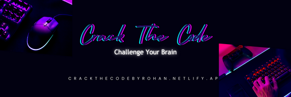

# 🎮 Crack the Code

Welcome to **Crack the Code** - a challenging number puzzle game! 🚀



## 🚀 Getting Started

1. **Clone the repository:**

   ```bash
   git clone git@github.com:RohanPatil01/Crack-the-code.git

2. **Open the Game:**

Navigate to the project directory.
Open index.html in your favorite browser.

## 💡 How to Play
- Enter a three-digit code and click on Generate the Clues.
- Crack the secret code using the generated hints.
    
## 🎮 Live Demo
Check out the live demo of the game hosted on [Netlify](https://crackthecodebyrohan.netlify.app/).

## 🌟 Features
- Dynamic and engaging gameplay.
- Responsive design for a seamless experience on all devices.

## 🤖 Code Generation Algorithm
Curious about how hints are generated? Check out the [Crack the code.ipynb](/Crack-the-code.ipynb) for better understanding of the game.

## 🖼️ Screenshots


## 🤝 Contributing
Found a bug or have a feature request? Feel free to open an issue or create a pull request.

## 📝 License
This project is licensed under the MIT License - see the [LICENSE](/LICENSE.txt) file for details.

## 🌐 Connect with Me
LinkedIn: [Rohan Patil](https://www.linkedin.com/in/rohanpatil01/)
